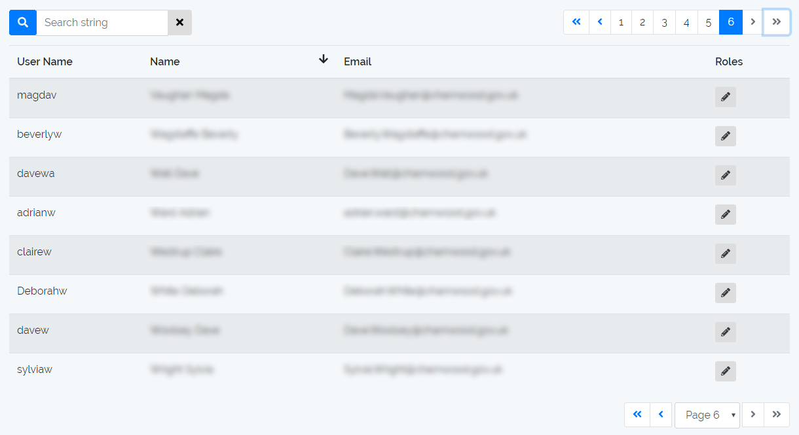

# Vuetable-2 Components Roll Up

This component uses the excellent vuetable-2 as a base to build on top of and deliver a componentised instance using search, pagination and field definitions.

A single component building an overall Bootstrap 4 styled table with props that determine what data is shown.
To get the best from it you'll need to include it in a project with Bootstrap 4 and Fontawesome.

## Screenshot


## Usage Example

```html
<template>
  <div id="table">
    <vuetable-base
      :fields-def="fields"
      :per-page="15"
      :sort-order="sortOrder"
      api-url="/admin/users"
      @row-clicked="onRowClicked"
    />
  </div>
</template>

<script>
import VuetableBase from 'VuetableBase'

import fieldsDef from 'fieldsDef'

export default {
  data () {
    return {
      fields: fieldsDef, // Field Definitions / rendering
      sortOrder: [{
        field: 'name',
        direction: 'asc'
      }]
    },
    methods: {
      onRowClicked (rowData) {
        // Magic happened
      }
    }
  }
}
</script>
```

### Example fieldsDef with Mixin

```javascript
import UsersFields from './usersFields.vue'

export default [
  /* Don't need to see the checkbox or id  */
  // '__checkbox',
  // { title: 'ID', name: 'id', sortField: 'id' },
  { title: 'User&nbsp;Name', name: 'username', sortField: 'username',
    titleClass: 'w-20'},
  { title: 'Name', name: 'name', sortField: 'name',
    titleClass: 'w-20' },
  { title: 'Email', name: 'email',
    titleClass: 'w-15' },
  {
    title: 'Custom Column',
    name: UsersFields,
    titleClass: 'w-65'
  }
]
```

#### usersFields.vue
```html
<template>
  <th
    v-if="isHeader"
    v-html="title"
  />
  <td v-else>
    {{ rowData }} <!-- Do something here -->
  </td>
</template>
<script>
import VuetableFieldMixin from 'vuetable-2/src/components/VuetableFieldMixin.vue'

export default {
  name: 'Userfields',
  mixins: [VuetableFieldMixin]
}
</script>
```

## Properties

| Prop | Type | Description |
| - | - | - |
| api-url | String | URL for axios to call for getting data |
| fields-def | Object | vuetable-2 field definition |
| per-page | Number | Number of rows per page for pagination |
| row-clicked | Function | Callback to execute when a row is clicked |
| sort-order | Array | Field to sort by and direction eg. `[{ field: 'name', direction: 'asc' }]` |
